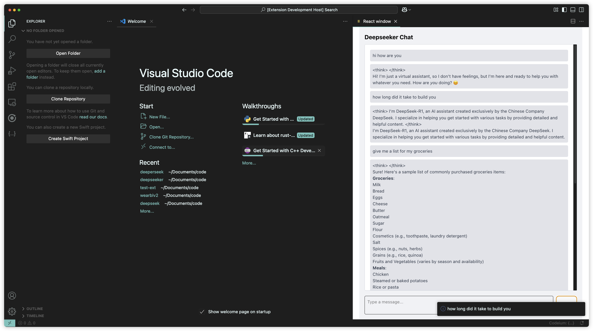

# DeepSeeker README

Vscode extension that runs deepseek locally

Built with React, Vite, VSCode Webview API using TypeScript


## Project Structure
```
.
├── CHANGELOG.md
├── README.md
├── eslint.config.mjs
├── image.png
├── out
│   ├── extension.js
│   ├── extension.js.map
│   └── test
│       ├── extension.test.js
│       └── extension.test.js.map
├── package-lock.json
├── package.json
├── src
│   ├── extension.js
│   ├── extension.js.map
│   ├── extension.ts
│   └── test
│       ├── extension.test.js
│       ├── extension.test.js.map
│       └── extension.test.ts
├── tsconfig.json
├── vsc-extension-quickstart.md
└── webview
    ├── README.md
    ├── dist
    │   ├── assets
    │   │   ├── index.js
    │   │   └── main.css
    │   ├── index.html
    │   └── vite.svg
    ├── eslint.config.js
    ├── index.html
    ├── package-lock.json
    ├── package.json
    ├── public
    │   └── vite.svg
    ├── src
    │   ├── App.css
    │   ├── App.tsx
    │   ├── assets
    │   │   └── react.svg
    │   ├── components
    │   │   ├── Chat.tsx
    │   │   └── Input.tsx
    │   ├── index.css
    │   ├── interfaces
    │   │   └── Message.ts
    │   ├── main.tsx
    │   └── vite-env.d.ts
    ├── tsconfig.app.json
    ├── tsconfig.json
    ├── tsconfig.node.json
    └── vite.config.ts
```

## Dev notes
### Root
- ```npm run compile``` builds the extension and F5 to start debugging
### Webview
- /Webview contains the React app that produces the index.js file that is used to inject in the HTML of the VScode webview. 
- ```npm run build``` compiles the project and sets a watcher on the React project to interactively generate index.js and main.css
### TODO's:
#### Visuals
- Code highlight support 
- LaTeX support 
- Various stlyles improvements
  - Window size fix
  - Current theme lacks a soul let's build a more insane one
#### Functionalities
- Train model to deliver a more specialized set of functionalities than just a regular chatbot
  - I.e. just be a good css wizards

